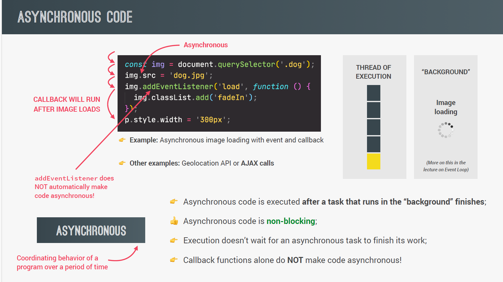
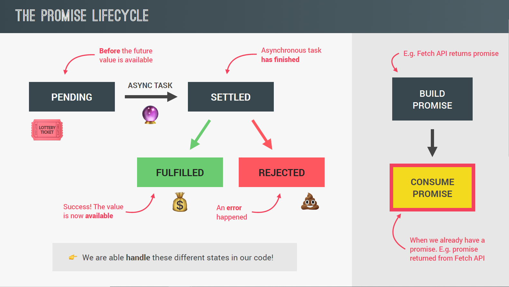

# Section 16: Asynchronous JavaScript: Promises, Async/Await and AJAX

_slides from page 197_

## Asynchronous JavaScript, AJAX and APIs

### Synchronous vs Asynchronous Code



- Synchronous code is executed line by line
- Asynchronous code is executed after a task that runs in the "background" finishes, for example, the background task could be:
  - A timer we set with `setTimeout()`
  - Fetching data from a server
  - Reading/writing to a file
  - etc.
    The code that is executed after the background task finishes is called a callback function.
- Asynchronous code is non-blocking, meaning that the rest of the code can still be executed while the background task is running.
- Asynchronous is all about coordinating behavior of a program over a period of time
- The asynchronous code refers to the entire operation that includes both the setTimeout function (or any other function that initiates an asynchronous operation) and the callback function that is executed after the asynchronous operation completes.
- Callback function alone does not automatically make a code asynchronous.
- Callback function is just a function that is passed as an argument to another function and is executed after some operation has been completed.
- We defer the execution of a function until a certain time in the future, or until a certain event has happened, which is exactly what asynchronous code is all about.
- Event listener does not automatically make a code asynchronous just like callback function. It is just waiting for an event to happen and then executes a callback function and there is no asynchronous behavior involved in this process. What makes the code asynchronous is the fact that the image is loading asynchronously in the background but not the fact that we are listening for the load event to happen.

## AJAX and APIs

- AJAX stands for Asynchronous JavaScript And XML
- AJAX allows us to communicate with remote web servers in an asynchronous way
- AJAX is not a technology on its own, but rather a term that refers to the use of a group of technologies together
- AJAX is a technique for creating fast and dynamic web pages
- AJAX allows web pages to be updated asynchronously by exchanging small amounts of data with the server behind the scenes. This means that it is possible to update parts of a web page, without reloading the whole page.
- AJAX is a misleading name because it has nothing to do with XML. It can be used with JSON as well.
- API stands for Application Programming Interface. It is a piece of software that can be used by another piece of software, in order to allow applications to talk to each other.
- The most popular data format for APIs is JSON, although XML is also still used.

### How AJAX Works

Flow of a Request with AJAX

1. New XMLHttpRequest object is created
2. XMLHttpRequest object sends the request to the server using the open() and send() methods. The open() method specifies the type of request and the URL of the resource to be fetched. The send() method sends the request.
3. The load event is fired when an asynchronous request is completed successfully.
4. The callback function is executed after the load event is fired.

```javascript
'use strict';

const btn = document.querySelector('.btn-country');
const countriesContainer = document.querySelector('.countries');

///////////////////////////////////////
const getCountryData = function (country) {
  // create a request object
  const request = new XMLHttpRequest();
  // open method is used to specify the type of request we want to make and the URL we want to make it to
  request.open('GET', `https://restcountries.com/v3.1/name/${country}`);
  // send method is used to send the request
  request.send();

  // load event is fired as soon as the data arrives successfully
  request.addEventListener('load', function () {
    // console.log(this.responseText);
    // destructuring the data and extracting the first element of the array [data]
    const [data] = JSON.parse(this.responseText);
    console.log(data);
    // console.log(data.currencies.EUR.name);
    // console.log(data.languages.por);
    const html = `
    <article class="country">
      
      <div class="country__data">
        <h3 class="country__name">${data.name.common}</h3>
        <h4 class="country__region">${data.region}</h4>
        <p class="country__row"><span>👫</span>${data.population}</p>
        <p class="country__row"><span>🗣️</span>${data.languages.por}</p>
        <p class="country__row"><span>💰</span>${data.currencies.EUR.name}</p>
      </div>
    </article>
   `;
    // insert a string of text as HTML into the DOM at the end of the countriesContainer element
    countriesContainer.insertAdjacentHTML('beforeend', html);
    countriesContainer.style.opacity = 1;
  });
};
// The two requests are sent at the same time, but the order in which they are finished is not guaranteed
getCountryData('portugal');
getCountryData('usa'); // current code won't work for this request because the API changed, for demo only
```

```html

 <body>
    <main class="container">
      <div class="countries">

      </div>
      <!-- <button class="btn-country">Where am I?</button> -->
      <div class="images"></div>
    </main>
  </body>
```

## How the Web Works: Requests and Responses

- What happens when we access a web server?

  - We type in the URL of a website
  - The browser sends a request to the server
  - The server sends back a response
  - The browser renders the page

- This is the client-server architecture or request-response model.

- TCP/IP is the protocol that allows computers to communicate over the internet. TCP is responsible for breaking down the message into smaller packets and reassembling them on the other end. IP is responsible for the delivery of the packets and makes sure that they arrive at the correct address.

## The Callback Hell

- Callback hell is a phenomenon when we have a lot of nested callbacks in order to execute asynchronous code in sequence. For example, we have to make a request to get a country, once we have the country, we have to make another request to get the neighbor country, and so on. This is a very common situation in real world applications.
- The problem with callback hell is that it makes the code hard to read and understand.
- The solution to callback hell is to use a modern feature of JavaScript called promises.

```javascript
setTimeout(() => {
  console.log('1 second passed');
  setTimeout(() => {
    console.log('2 seconds passed');
    setTimeout(() => {
      console.log('3 second passed');
      setTimeout(() => {
        console.log('4 second passed');
      }, 1000);
    }, 1000);
  }, 1000);
}, 1000);
```

## Promises and the Fetch API

### What is a Promise?

- A promise is an object that is used as a placeholder for the future result of an asynchronous operation.
- A promise is a container for an asynchronously delivered value.
- A promise is a special JavaScript object that links the "producing code" and the "consuming code" together.
- A promise is a container for a future value. The value can be either a resolved value or a reason that it's not resolved (rejected).
- We no longer need to rely on events and callbacks passed into asynchronous functions to handle asynchronous results.
- Instead of nesting callbacks, we can chain promises for a sequence of asynchronous operations to escape callback hell, one after another, where each subsequent operation starts when the previous one finishes.

### The Promise Lifecycle



- pending: before the future value is available
- fulfilled: the operation completed successfully
- rejected: the operation failed
- settled: the promise has fulfilled or rejected, but not pending

```javascript
const getCountryData = function (country) {
  fetch(`https://restcountries.eu/rest/v2/name/${country}`)
    .then(function (response) {
      return response.json();
    })
    .then(function (data) {
      renderCountry(data[0]);
    });
};
getCountryData('portugal');

const renderCountry = function (data, className = '') {
  const html = `
  <article class="country ${className}">
    
    <div class="country__data">
      <h3 class="country__name">${data.name}</h3>
      <h4 class="country__region">${data.region}</h4>
      <p class="country__row"><span>👫</span>${(
        +data.population / 1000000
      ).toFixed(1)} people</p>
      <p class="country__row"><span>🗣️</span>${data.languages[0].name}</p>
      <p class="country__row"><span>💰</span>${data.currencies[0].name}</p>
    </div>
  </article>
  `;
  countriesContainer.insertAdjacentHTML('beforeend', html);
  countriesContainer.style.opacity = 1;
};
```

> Get neighboring country using Promise

```javascript
const getCountryData = function (country) {
  // Country 1
  fetch(`https://restcountries.com/v3.1/name/${country}`)
    .then(response => response.json())
    .then(data => {
      console.log(data);
      renderCountry(data[0]);
      const neighbour = data[0].borders[0];
      if (!neighbour) return;
      // Country 2
      return fetch(`https://restcountries.com/v3.1/alpha/${neighbour}`);
    })
    .then(response => response.json())
    .then(data => renderCountry(data, 'neighbour'));
};

getCountryData('portugal');
```
